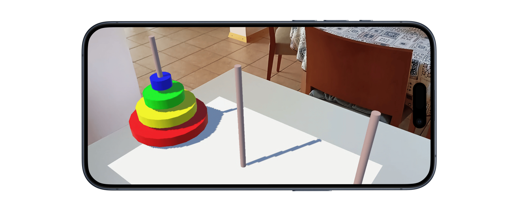

# Tower of Hanoi AR

 Tower of Hanoi is a classic puzzle game made in Unity with Vuforia Engine.

## Rules

- Move disks from first stick to the last
- One disk can be moved at the time
- Don't put larger piece on smaller one

# Instalation

Go to [releases](https://github.com/urluur/Tower-of-Hanoi-AR/releases), choose the latest release and install ToH.apk on your Android device.

## Playing the game

- You'll need to print this [picture](https://github.com/urluur/Tower-of-Hanoi-AR/blob/main/img/tower.jpg) of the Hanoi Tower
- Launch the app
- Point the camera at the picture and watch the AR game come to life